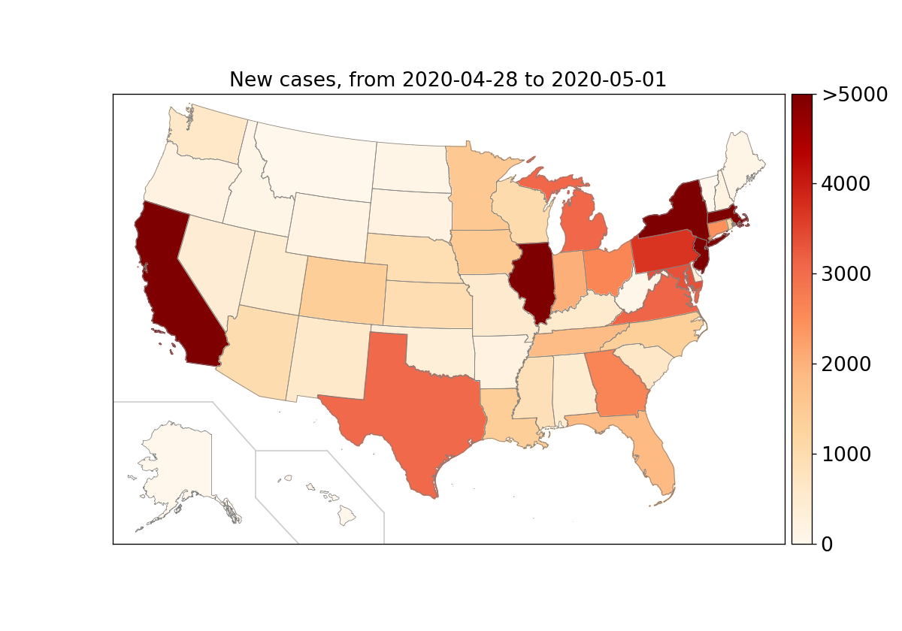
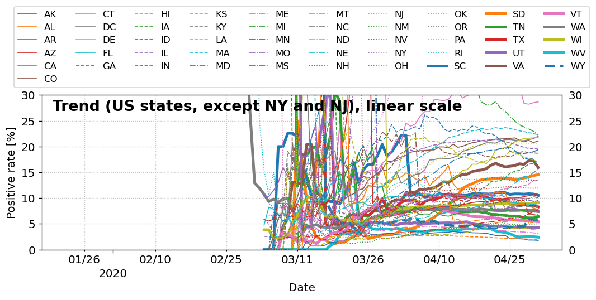

# COVID19-data-visualization
_Data visualization of some COVID-19 data_

## Data source
The data comes from The COVID Tracking Project (https://github.com/COVID19Tracking/covid-tracking-data and the New York Times (https://github.com/nytimes/covid-19-data).

## Visualizations from the data
_(Will be updated daily, following the update of the data source.)_

## How to reproduce these figures
To reproduce the figures, run `./scripts/Run_all.py`, which runs all other scripts in the same folder. The output figures are saved in the `output_figures` folder.

The Python packages used to produce these figures:
  - numpy: 1.11.0+
  - pandas: 0.20.0+
  - matplotlib: 2.1.0+
  - basemap: 1.0.7+ (https://github.com/matplotlib/basemap)
  - plot-utils: 0.6.2+ (https://github.com/jsh9/python-plot-utilities)

## Terms and conditions
Reusing contents (such as figures or code) of this repository is permitted, provided that this repository is cited, AND all the terms and conditions outlined the `LICENSE` file are met.
